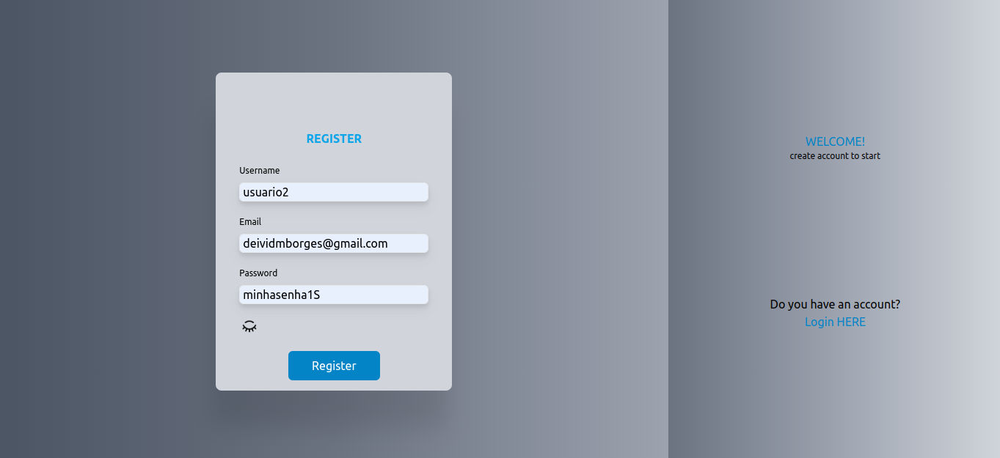
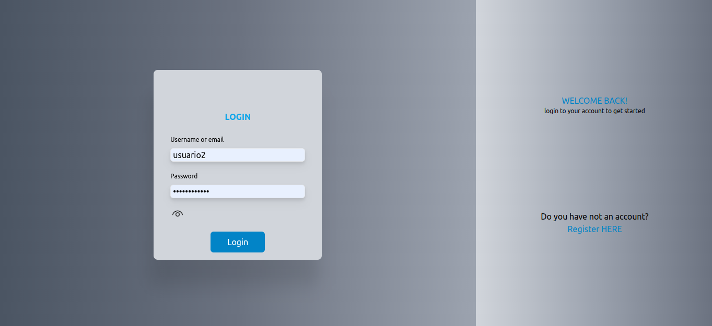

# Registration and Login Frontend System
 - Welcome to the Registration and Login frontend system! This application allows users to register and login to their accounts.

  ## Features
  - User registration page
  - User login page
  - Password encryption
  - User token validation
  - Validation for existing users
  - Login with username or email

  ## User and Password requirements:
  - Username must be at least 3 characters long
  - Password must be at least 8 characters long
  - Password must contain a number
  - Password must contain a capital letter

  ## Technologies and tools:
  
  
  

  
  
  
  

# Prerequisites

Before you start, you will need to have the following tools installed on your machine:

# Getting Started

Follow these steps to get the application up and running:

- Clone the repository
~~~Java
git@github.com:DeividBorges93/register-and-login-frontend.git
~~~

- Install the dependencies
~~~Java
npm install
~~~

- Start the application
~~~Java
npm run dev
~~~

## With Docker

 - Loading...

## Pages

### Register
> /register

### Login
> /login

